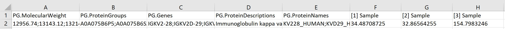
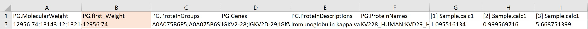

##  SWATH-MS Total Protein Approach Calculator

Automates the time-consuming process of calculating label-free and standard-free protein concentration using the Total Protein Approach [(Wiśniewski, 2017)](https://doi.org/10.1016/bs.mie.2016.10.002) from SWATH-MS data.

## Description
This R script takes a SWATH-MS .cvs file from Spectronaut (or equivalent software) and calculates the protein concentration using the Total Protein Approach.

### Total Protein Approach
Protein concentration (pmol/mg protein) = (Total Intensity/(Total Protein Intensity * MW (g/mol)) * 10^9

Note: 
* Literature protein concentration calculated to mol/g protein [(Wiśniewski, 2017)](https://doi.org/10.1016/bs.mie.2016.10.002)
* R script default calculated to pmol/g protein
* 10^9 conversion factor can be changed in R script

### Input File

The data frame of the .csv input file is formatted with proteins designated by rows and samples by columns. The current code will work with any number of target rows and column samples.

The current configuration expects column A to be labeled exactly "PG.MolecularWeight". The cells in column A can have any number of MWs that are separated by ";". The code is written to take the first MW value in each cell and separate it into its own column, "PG.first_Weight".

Columns B to E are reference columns.

Samples are expected to start at column F of the data frame. The format of each column sample name dictates that it should have a prefix of "[i]", where "i" is a non-critical label (i.e., number from 1 to the total number of samples, the same number repeated, letter). The script identifies the column name belonging to a sample from the "[ ]" characters. Each column sample name should be unique, otherwise only the first column with the repeated sample name will be calculated.

The code proceeds to calculate sums of protein intensity for each sample column, ignoring non-numeric data. Where non-numeric data appears in the sample columns any text will be replaced with an NA and appear as a blank in the .csv output file.

### Output File

The final result is a separate output .csv file with the title of "TPA-calc_{timestamp}_{input file name}".

Column A contains the original input data from "PG.MolecularWeight". The first molecular weight, "PG.first_Weight", is inserted into column B. The original references are shifted to column C to F.

The output Total Protein Approach calculations appear in the  sample columns beginning in column G, which have the original name of the samples with the suffix of ".calc1".

The calculations are delivered in the form of one sequential script "swath_total_protein_approach_calc.R".

Only one step is required and that is to run the script once per calculation. 

## Getting Started

### Dependencies

* R Version 4.1 or later
* RStudio 1.4.1 or later
* Spectronaut (or equivalent software)
* Script known to run in Mac OS X, Ubuntu 18, and Windows 10

### Installing

1) Install R 4.1 or later (from r.project.org select "download R" and choose preferred CRAN mirror site to get software)
https://www.r-project.org/
2) Install RStudio Version 1.4.1 or later
https://www.rstudio.com/products/rstudio/download/
3) Acquire "swath-total-protein-approach-calc" project
    * by Download
        * From https://github.com/teresasierra/swath-total-protein-approach-calc
        * Select Code
        * Download Zip
    * by Git clone of https://github.com/teresasierra/swath-total-protein-approach-calc.git

### Executing Program

1) Place one SWATH-MS formatted .cvs file in the "input_file" directory found immediately under the main "swath-total-protein-approach-calc" project directory.
    * You may only process one file at a time
        * The calculations will abort if there's more than one .csv file present. 
            * If you force the script it will corrupt the program and RStudio will have to be reinstalled.
        * Any file name name is acceptable, it will be detected and used as a base name.
  
2)  Run the "swath_total_protein_approach_calc.R" script in RStudio.
    * Open RStudio
    * Open Project: swath-total-protein-calc.Rproj
    * Open File: swath_total_protein_approach_calc.R
    * Change conversion factor if needed
        * Line 20 of script; default (10^9)
	* Highlight all rows and select Run

3)  Output files will be found in the appropriate directories.
    * input_file
        * The original file will be deleted on the successful completion of the calculations.
        * A copy of the original file will be found in "raw_input_history".
    * output_files
        * "TPA-calc_{timestamp}_{input file name}"
    * raw_input_history
        * "raw_input_{timestamp}_{input file name}"
    
## References
* Wiśniewski J. R. (2017). Label-Free and Standard-Free Absolute Quantitative Proteomics Using the "Total Protein" and "Proteomic Ruler" Approaches. Methods in enzymology, 585, 49–60. https://doi.org/10.1016/bs.mie.2016.10.002

## Authors

Contributor names and contact info:

* [Jay Venti](jayventi@gmail.com)  
* [Teresa Sierra](teresa_sierra@uri.edu)  

## License
This project is licensed under the GPL-2
* [GNU GENERAL PUBLIC LICENSE Version 2](https://www.r-project.org/Licenses/GPL-2)

## Acknowledgments

[Dr. Akhlaghi Lab](https://web.uri.edu/pharmacy/research/akhlaghi/)
* Dr. Nick DaSilva
* Dr. Ben Barlock
* Dr. Rohitash Jamwal

[Bioinformatics (BPS542)](https://web.uri.edu/pharmacy/2013/08/16/bps542-bioinformatics-i/)
* Dr. Christopher Hemme
* Dr. Lenore Martin
* Hep4Life Team (Winifer Ali, Qiwen Chen, and Sabah Ummie)

